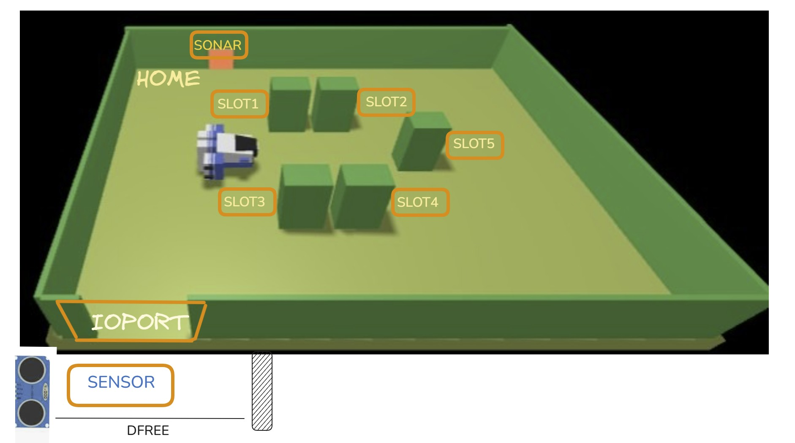

# Sprint 0

## Obiettivi
L'obiettivo prinicipale dello sprint 0 è analizzare i [requisiti](../requisiti.md) forniti dal committente riguardo al progetto **TemaFinale25** eliminando eventuali ambiguità relative ai termini utilizzati e formalizzando quest'ultimi con dei componenti software (già sviluppati o da sviluppare). 

Una volta formalizzati i requisiti si procederà con la definizione di una prima **architettura logica generale del sistema** che sarà il riferimento iniziale per lo sprint 1. Questa architettura iniziale sarà costituita dai **macro-componenti principali** (bounded context) deducibili dal documento dei requisiti, e dalle **interazioni** tra quest'ultimi sotto forma di messaggi (mappa di contesto). L'architettura logica sarà anche corredata di un relativo piano di test iniziale.

Terzo e ultimo obiettivo dello sprint 0 sarà quello di definire un **piano di lavoro** in cui si definirà il numero e gli obiettivi degli sprint necessari al completamento del sistema. Inoltre, in questa sezione si deciderà come suddividere il lavoro tra i membri del gruppo e quali sprint potranno essere realizzati in parallelo.


## Requisiti
I requisiti sono descritti dal committente nel documento: [documento dei requisiti](../requisiti.md) 

## Analisi dei requisiti
- disambuiguiamo i termini 
- diciamo quali componenti sono da sviluppare
- quali sono da formalizzare con un pezzo di software già in nostro possesso
- cosa è un attore, cosa è un POJO, più eventuali attributi di entità
- ricorda anche di formalizzare quelli che saranno i macrocomponenti del sistema
- **pezzo relativo alla mappa e wenv praticamente da copiare e incollare**
- ricorda di linkare alla repo del corso i progetti che si possono riciclare


In seguito la fomalizzazione dei termini trovati all'interno del documento dei requisiti.


#### Differential Drive Robot (DDR)
robot **fisico** capace di muoversi utilizzando due ruote motrici indipendenti che gli consentono di avanzare, arretrare o ruotare su sé stesso. 
- All'interno del sistema il DDR verrà utilizzato come supporto fisico per l'implementazione del _cargorobot_.


#### Hold (deposito)
- rettangolare
- slots
- IO-Port
- Home
- teoricamente POJO ma meglio ATTORE per:
    - thread-safety
    - SRP (cargorobot non gestisce la logica dei dati)

#### Slot
they are the hold storage areas and are occupied by product containers

#### IO-port
è dove i product containers arrivano in attesa di essere recuperati dal cargorobot

#### Home
locazione all'interno del deposito da cui parte e ritorna il cargorobot dopo ogni richiesta di carico 

#### Load (Carico) 


#### Cargo Robot
robot **logico** capace, **sotto richiesta**, di: muoversi liberamente all'interno del _deposito_, recuperare un container dall'_IO-port_, posizionare un container precendentemente recuperato in uno degli _slot_ liberi all'interno del _deposito_

**Il committente fornisce del software per la modellazione del _cargorobot_**. In particolare:
- l'ambiente virtuale [WEnv](./sprint0.md) (aggiusta link) che simula la stiva di una nave in cui il _cargorobot_ dovrà operare
- un componente software chiamato [basicrobot](./sprint0.md) (aggiusta link) che permette di governare un DDR virtuale all'interno di WEnv 
    - c'è un leggero abstraction gap rispetto ai requisiti del cargorobot e quelli che soddisfa il basicrobot. Il cargorobot deve anche:
        - saper recuperare un container per poi trasportarlo
        - saper rilasciare un container
    - diventa quindi necessario estendere il basicrobot per implementare anche queste funzionalità

**dettagli WEnv**
// parla della mappa




**dettagli basicrobot**
// Il robot è un oggetto di dimensioni finite, inscrivibile in un cerchio di diametro D (unità robotica) ed esegue movimenti a velocità costante.

// Il basicrobot fornito dal committente è un puro esecutore di comandi, con cui il robot può effettuare singole mosse o sequenze di mosse, a seguito di messaggi di richiesta.

```
listone messaggi con cui si può interagire con il basicrobot 
```


#### Product/Freight (prodotto/merci)
- racchiusi all'interno di un container e posizionati all'interno di uno slot
- peso
- pid

#### Register (registrare)


#### Container


#### Product Service
- si interfaccia con un database


#### Sonar sensor
- put in front of the io-port
- used to detect the presence of a product container when it measures a distance D, such that D < DFREE/2, during a reasonable time (e.g. 3 secs).
- attore in quanto ente attivo, che osserva le misurazioni per 3 secondi e successivamente aggiorna i suoi clienti


#### cargoservice
- macrocomponente core buisness del sistema
- Fa da orchestrare.
- riceve le richieste di carico
    - sotto determinate condizioni le rifiuta


#### dynamically-updated web gui
pagina web che mostra graficamente, in tempo reale, lo stato del deposito e la posizione del cargorobot al suo interno
- **caro committente, come facciamo a mandare una richiesta? chi la manda? la mettiamo come possibilità dentro la gui?**


...


## Macro-componenti


## Architettura logica generale del sistema


### messaggi


## Piano di test

vari scenari... 
- es. richiesta di carico con peso massimo già raggiunto


## Piano di lavoro


## Team
link vari e (molto importante) le nostre foto